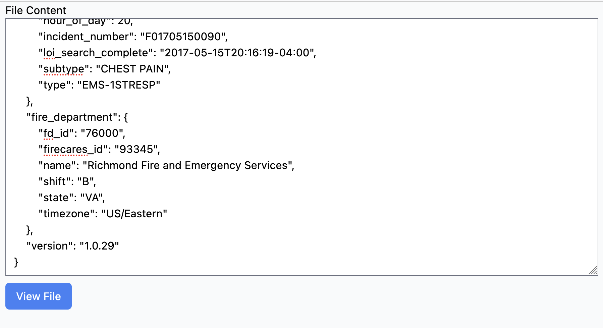
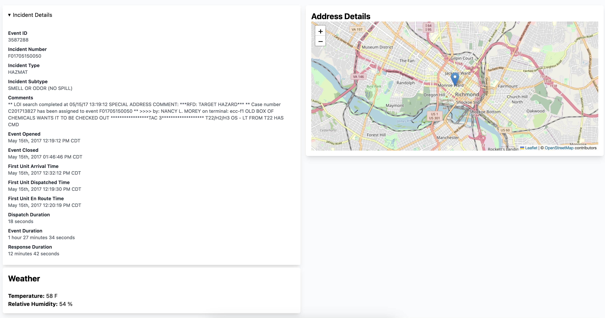
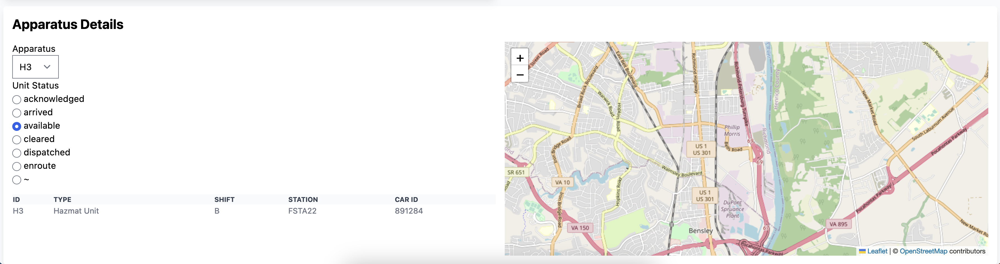

# incident-reports

An incident report viewer for 911 emergency calls.

## Setup

1. On macOS, [download and install the latest LTS of Node.js](https://nodejs.org/en).
2. [Install yarn](https://yarnpkg.com/getting-started/install)
3. Clone the repo:

```bash
git clone git@github.com:samwightt/incident-reports
```

4. CD into the repo:

```bash
cd incident-reports
```

5. Run the dev server and open `http://localhost:5173`:

```bash
yarn dev
```

The repo should contain all of the dependencies already as it is using Yarn's Zero Installs feature. If you get an error about missing dependencies, run `yarn install` in the root of the repo.

No API keys to set up here. Was able to use the OSM layer apparently.

## How to use this

1. Open the JSON file you want to view in a text editor and copy the JSON.
2. Run the dev server and open http://localhost:5173.
3. Paste the JSON file in there and click the 'View File' button.



4. Expand 'Incident details' to view details about the incident. You can also look at weather (only two stats, sorry lol I figured that would work) and the location of the address on the right. Click the pin in the map to show info about the address. Note that the weather is fetched using an API that doesn't require an API key, but it is rate limited to 10,000 requests a day. This shouldn't request that much but do keep it in mind lol.



5. Apparatus details can be viewed at the bottom of the page. Select the apparatus you want to view in the dropdown. Then select the type of status you want to view the location of. The location will show up in the map on the right, changing when you select a different one. Click on the pin to see the timestamp (could be a better user experience definitely but it's the best I got for now 😅). The table at the bottom shows info about the apparatus.



6. If you want to view the production version of the app, run `yarn build` and then `yarn preview`. This will show things using the real minified code (I'm pretty sure). You can also enter a different JSON file without reloading the page and everything should update as needed. If you enter invalid JSON it'll tell you.

## Commentary

I spent around 4-ish hours doing this, with 2-3 breaks in there for lunch and stuff. Writing this took a bit longer but oh well. Also had a bitttt of trouble getting my dev environment set up.

Things I would've liked to do with a lot more time:

- Tests. Tests tests tests. I wanted to write browser tests for this with Playwright but didn't really want to spend the time learning how to test Leaflet. So instead I used Vite and tested regularly in my browser. This worked pretty well as Vite gives you a tight feedback loop, but it would've been nice to have those too.
- Possibly per-component unit tests? I don't really know if they'd be needed here with proper E2E tests but it would be nice.
- Test coverage, CI / CD, deployment setup, etc. Just tools that make it really to write good tests and know which one's you're missing.
- Probably would've used another framework. I'm familiar with Tailwind and it allows me to move really fast and get something decent-looking out the door, but I would've liked to learn another simple library and use that.

Things I would've done if this was a real project:

- Talked directly to the customer or talk a good bit with the product manager. I like to be familiar with what's important to customers, as it helps me figure out how things need to work. I'd like to get a good idea of what the customer's use case is, what they need to do quickly, and what's not as important.
- Chosen a tech stack the rest of the team is comfortable with. I know React, Tailwind, and TypeScript very well, but future maintainers might not be. If this is a project that's going to see continued maintenance, then it's better to pick something that might be slower to develop in or that I might not be as familiar with, but that will be easier to maintain by people other than me. If this is a quick one-and-done project, then the choices here are okay.
- Spend more time refactoring the code into a better, more understandable state. Don't get be wrong, what's here is pretty idiomatic React, but I wanted to get as much of the data displayed as possible and refactor after I was done. What is here is pretty alright I think, but there definitely could be a lot of improvement. On real projects I like to do TDD which, while slower at the start, makes it very, very easy to make code that's well-designed and easy to maintain in the future.
- Make fewer commits generally. On feature branches or projects that are going to be reviewed by other devs, I like to make a good amount of commits so that the reviewing dev can get a better idea of what I'm thinking and trying to accomplish. This isn't a substitute for documentation in the code, good variable names, etc. etc. but it makes it nice at least for me to review. It also makes it easy to rollback quickly on an experimental project like this.
- Better accessibility. A decent chunk of what I wrote is accessible because it either uses native browser behavior or uses ARIA labels correctly, but I didn't have time to test things like the map or some of the more complicated interactions.
- Better UI! Working with a designer would've been great.
